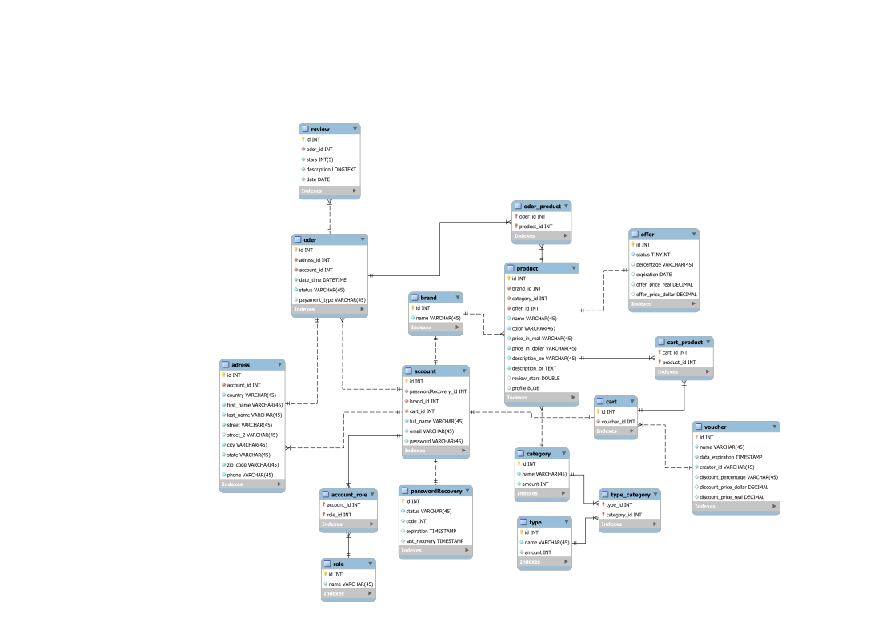

# E-commerce

## Description
This project focuses on learning. It is an API for an E-commerce that is still in development. Currently, the idea is that on the site it is possible to have interaction as a user and as a brand, that is, you can both buy products and post your products for sale. In addition to having features such as a favorites list, shopping cart, product reviews, payment methods and most of the things an e-commerce business should have.

## Technologies

    
    
    
    
    
    
    
    
    

## Diagram

    

